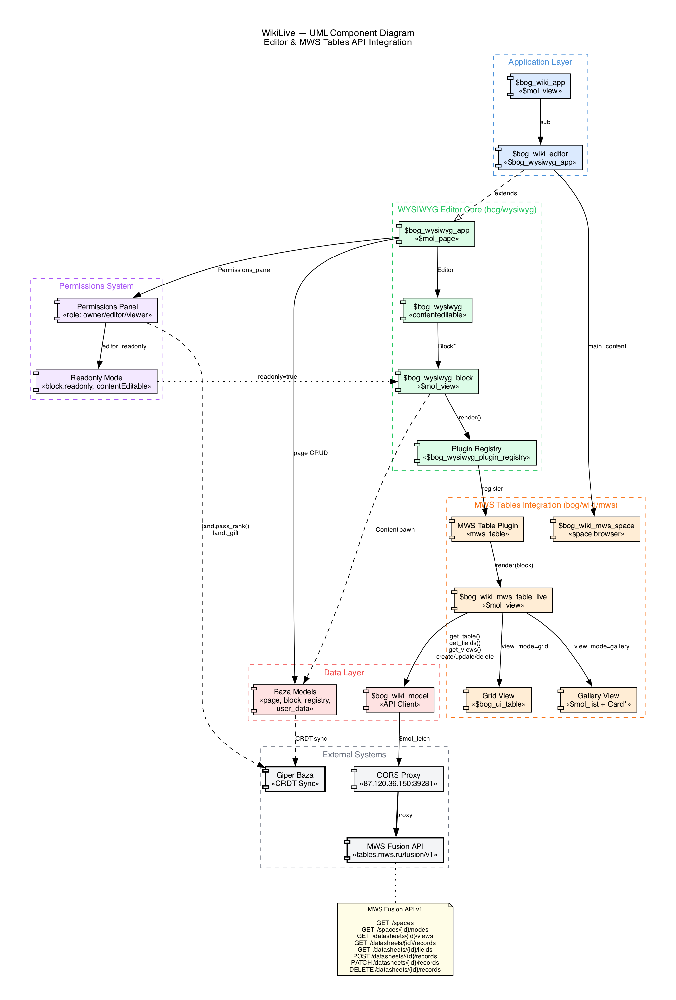

# WikiLive

## Wiki-editor with live MWS Tables integration

WYSIWYG | Real-time CRDT sync | Inline table editing | Zero backend

Open-source (MIT) | $mol framework | Giper Baza

**True Tech Hack 2026 | Team 10-10**

---

# Проблема и решение

### Проблема
- Данные MWS Tables изолированы от документации
- Wiki-страницы и таблицы живут в разных инструментах
- Нельзя редактировать данные таблицы прямо в вики-странице

### Решение: WikiLive
- WYSIWYG wiki-редактор с **живыми таблицами MWS** как полноценными блоками
- Inline-редактирование ячеек синхронизируется с MWS API в реальном времени (PATCH, debounce 1с)
- Grid & Gallery виды, slash-menu, backlinks, CRDT-коллаборация
- **0 строк бэкенда** — всё работает на клиенте

---

# Архитектура

**UML Component Diagram**



---

# Интеграция с MWS Tables

**Full CRUD через Fusion API v1**

- **$bog_wiki_model** — API-клиент, 8 эндпоинтов
- GET: spaces, nodes, views, records, fields
- POST / PATCH / DELETE: records (create, update, delete)
- Bearer token auth через CORS-прокси
- **Реактивный кеш** через @$mol_mem_key + data revisions
- Inline cell editing: ввод → debounce 1с → PATCH к API
- Add Row (POST), Delete selected (DELETE), Refresh
- **Переключение видов**: views из API, переключатель в тулбаре
- Режимы отображения: Grid (таблица) / Gallery (карточки)

---

# Живая таблица внутри вики-страницы

**Таблица — живой объект, не статичный embed**

- Slash-menu: `/` → MWS Table → ввод dstId
- **Таблица рендерится inline** как $mol-компонент в теле страницы
- contentEditable=false для блока таблицы
- Plugin Registry с render() callback + WeakMap кеш
- Редактирование ячейки → real-time PATCH к MWS Fusion API
- **Двусторонняя синхронизация**: WikiLive ↔ MWS Tables
- Тулбар: переключатель видов, режим, refresh, add/delete
- Сохраняется после перезагрузки (конфиг в Giper Baza)

<!-- SCREENSHOT: таблица внутри страницы редактора -->

---

# WYSIWYG-редактор

**Блочный, contenteditable, open-source MIT**

| Основа | Расширения |
|--------|-----------|
| Типы блоков: параграф, H1-H6, списки, цитаты, код, изображения | Image upload: drag & drop, paste |
| Slash-menu ( / ) со всеми плагинами | Embed: YouTube, Vimeo, iframes |
| Markdown-шорткаты: #, ##, >, \`\`\`, - | AI-блок: генерация контента через LLM |
| Enter = новый блок, Backspace = удалить | Wikilinks: \[\[page name\]\] |
| Tab / Shift+Tab = уровень | Автоматические backlinks |
| Drag & drop блоков | Комментарии к блокам |

<!-- SCREENSHOT: редактор с контентом -->

---

# Slash-menu и горячие клавиши

### Slash-menu плагины:
- Paragraph, Heading H1-H6, List, Quote, Code
- Image, Embed (YouTube, Vimeo), MWS Table, AI
- Расширяемо: любой плагин через $bog_wysiwyg_plugin_registry

### Горячие клавиши:
- `# + Space` = H1 | `## + Space` = H2 | `###` = H3 ...
- `> + Space` = Blockquote | ``` + Space` = Code block
- `- + Space` = List item | `Enter` = New block
- `Backspace` (пустой) = Remove block | `Tab` = Indent

<!-- SCREENSHOT: slash-menu открыто -->

---

# Backlinks и граф страниц

- **Wikilinks**: `[[page name]]` для ссылок между страницами
- Автоматический поиск обратных ссылок по всем страницам
- all_pages_info() сканирует HTML всех блоков

- **Интерактивный граф страниц**
- Клик на узел = навигация к странице
- Переключатель графа в тулбаре

- **Сайдбар** со списком страниц + rename + create
- Множественные реестры (тетради)

<!-- SCREENSHOT: граф страниц -->

---

# Совместная работа в реальном времени

**Giper Baza CRDT — conflict-free sync**

- **Каждая страница** = отдельный Giper Baza Land
- **Каждый блок** = типизированный Pawn внутри Land
- CRDT типы данных: конфликты невозможны by design
- Синхронизация по дельтам между всеми клиентами
- Несколько пользователей редактируют одновременно

- **Серверная логика не нужна** — sync через relay-ноды
- Автоматический merge параллельных правок
- Real-time распространение изменений

---

# Пользовательский опыт

| Удобство | Скорость |
|----------|----------|
| Чистый блочный layout | Мгновенное автосохранение (CRDT) |
| Сайдбар с навигацией по страницам | Нет спиннеров для локальных данных |
| Тулбар: реестры, история, граф, права, профиль, тема | Inline-редактирование таблиц без попапов |
| Тёмная / светлая тема (один клик) | Drag handles для блоков |
| Адаптив: десктоп, планшет, телефон | MWS Table: Grid & Gallery |
| Локализация: RU + EN | Регистрация за 0 кликов |

<!-- SCREENSHOT: интерфейс с тулбаром -->

---

# Дополнительный функционал

| Фича | Фича |
|------|------|
| Комментарии к блокам | Web Component — встраивание в любой сайт |
| История версий (snapshots) | Билды под все ОС (Tauri) |
| AI-генерация контента (LLM) | Pull-реактивность (нет Virtual DOM) |
| Интерактивный граф страниц | Offline First ($mol_offline) |
| Система плагинов (расширяемая) | Graceful degradation при потере сети |
| Embed виджеты (YouTube и др.) | Proof of Work (антифлуд) |
| UI прав доступа (owner/editor/viewer) | E2E шифрование по умолчанию |

---

# Zero Backend Architecture

**0 строк серверного кода написано**

- **0 строк бэкенда** — нет сервера, нет API, нет базы данных
- Giper Baza: хранение, синхронизация, авторизация, шифрование
- Хостинг = статический файл-сервер (любой CDN)

- **E2E шифрование** по умолчанию — утечка базы = зашифрованный blob
- **Proof of Work** — не нужен WAF, rate limiting, captcha
- **Авторегистрация**: криптоключ при первом визите, 0 кликов

- Клиент: IndexedDB + CRDT + relay sync
- MWS Tables API: единственная внешняя интеграция (CORS-прокси)

---

# Технологический стек

| Технология | Назначение |
|-----------|-----------|
| **$mol** | Реактивный UI-фреймворк, pull-reactivity, нет Virtual DOM, 3x меньше кода |
| **MAM** | Zero-config сборка, авто-зависимости, tree shaking |
| **Giper Baza** | CRDT-база, E2E шифрование, offline-first, real-time sync |
| **TypeScript** | Полная типизация: компоненты, стили (CSS-in-TS), bindings |
| **view.tree** | Декларативный UI DSL, двусторонние привязки |
| **MWS Fusion API** | REST API v1 для CRUD таблиц, views, fields, spaces |
| **MIT License** | Open-source: github.com/b-on-g/wysiwyg |

---

# Возможности развития

| Ближайшее | Перспектива |
|-----------|------------|
| Enforce permissions (CRDT-level) | Mobile-native (Tauri Mobile) |
| MWS Tables: Kanban view | Collaborative cursors (presence) |
| MWS Tables: создание таблиц | Формулы и вычисляемые поля |
| Design Kit интеграция | Custom block plugin SDK |
| Полнотекстовый поиск | Public sharing links |
| Экспорт: PDF, Markdown, HTML | Библиотека шаблонов страниц |

---

# Итого

- ✓ Полная CRUD-интеграция с MWS Tables (8 API endpoints)
- ✓ Живое inline-редактирование таблиц с real-time API sync
- ✓ WYSIWYG блочный редактор: slash-menu, горячие клавиши, drag & drop
- ✓ Wikilinks + автоматические backlinks + граф страниц
- ✓ Совместная работа через CRDT (Giper Baza)
- ✓ Open-source редактор, MIT лицензия
- ✓ **0 строк бэкенда | E2E шифрование | Offline First**
- ✓ **14 дополнительных фич сверх требований**

**github.com/b-on-g/wiki | github.com/b-on-g/wysiwyg**
